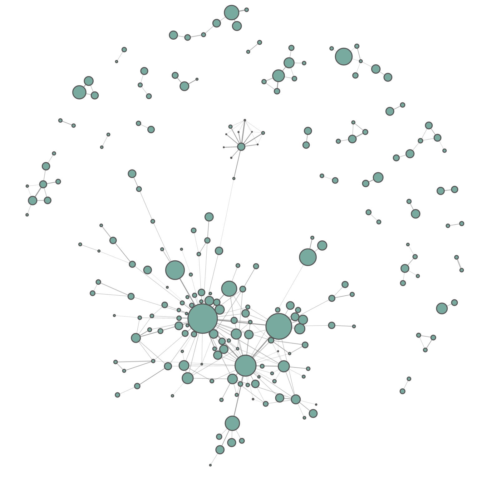

# Squashy Quickstart Tutorial
## Introduction
In this tutorial we cover the basics of loading data, compression and then demonstrate a number of ways to explore the
compressed graph.

The dataset we will use is the 'Subreddit Hyperlink Network' which represents the relationships between different
communities on [Reddit](https://www.reddit.com/).
Each row represents a post in a community that links to a different Reddit community.

Whilst there are a lot of different properties for each post, for this tutorial we'll keep things simple and just consider the source community of the post and the target community that it linked to.

We will specifically be using `soc-redditHyperlinks-body.tsv` available to download directly from [SNAP](https://snap.stanford.edu/data/soc-RedditHyperlinks.html). It's recommended that you download the TSV file first as it is quite large and we'll be loading it in chunks to keep memory use low.

[Download the dataset from SNAP](https://snap.stanford.edu/data/soc-RedditHyperlinks.html)

## 1. Loading the Data
First we'll iterate through the dataset in discrete chunks. We'll only load the two columns we need, `SOURCE_SUBREDDIT` and `TARGET_SUBREDDIT`, and we'll convert those rows into a list of tuples using Pandas' `.to_records()` method.

```python
import pandas as pd

# You may need to adjust the path to point to where you have stored the dataset.
DATA_PATH = 'soc-redditHyperlinks-body.tsv'

edge_tuples = []

with pd.read_csv(DATA_PATH, usecols=['SOURCE_SUBREDDIT','TARGET_SUBREDDIT'],
                 sep='\t', chunksize=10000) as reader:
    for chunk in reader:
        edges = chunk.to_records(index=False).tolist()
        edge_tuples.extend(edges)
```
This will produce a list of tuples, which is our edge list.
```python
>>> edge_tuples[:5]
[('leagueoflegends', 'teamredditteams'),
 ('theredlion', 'soccer'),
 ('inlandempire', 'bikela'),
 ('nfl', 'cfb'),
 ('playmygame', 'gamedev')]
```
Next we load the edge list into our database using the Squashy `DataImporter` class. We specify that the nodes are type `SUBREDDIT`, and the edges are type `LINKS_TO`. These labels are purely descriptive and it is advised that you name your nodes and edges in a way that describes the relations represented.

```python
from squashy import DataImporter

loader = DataImporter(address='localhost', port=7687, node_label='SUBREDDIT', edge_label='LINKS_TO')
loader.load_from_edge_list(edge_tuples)
```
!!! failure "OperationalError"

    If you get an `OperationalError` this is likely because Memgraph is not running.
    Please use Docker to [start a Memgraph instance](installation.md) before continuing. 
    If your instance is running, check the address and port number passed to `DataImporter` and adjust if necessary.

Once the data is loaded we can ask for the loader to `.report()` and check that we have data in our Memgraph instance.
```python
>>> loader.report()
'Database currently has 35,776 SUBREDDIT nodes, and 137,821 LINKS_TO edges.'
```
## 2. Compressing the Graph
Now we have the data loaded, we are ready to compress it. The goal is to take our raw graph of 35K nodes and 100K+ edges 
and to generate a new graph that represents the latent structure of the original. 
First we need to create an instance of the `Squash` class and tell it what nodes, relations and weight property it should 
use. We also tell it the `db_address` and `db_port` for demonstration purposes, however if no values are given, it will
use `localhost:7687` as the default address.

```python
from squashy import Squash

squasher = Squash(node_label='SUBREDDIT', relation_label='LINKS_TO', weight_label='weight', 
                  db_address='localhost', db_port=7687)

```
In the next step we initiate the compression process. It may take some time to complete but progress bars will provide 
some insight into the compression process. Whilst it is best to allow the process to run to completion, it is resumable
should an interruption occur. 

We limit the maximum number of cores to 400 using `max_cores`, specify that during the decomposition stage a core will be identified
once all remaining nodes have a degree of `k`, and that during the core assignment phase nodes will be assigned a core that is
at most two hops away (`max_hops`).

```python
squasher.squash_graph(max_cores=400, k=2, max_hops=2)
```

## 3. Examining the compressed graph
Once the process is complete we can examine our compressed graph. Note that Squashy is non-destructive and the original graph data is still intact in the database.

```python
nodes = squasher.get_core_node_list()
edges = squasher.get_core_edge_list()
```
```python
>>> len(nodes)
221
```
```python
>>> len(edges)
330
```
```python
>>> nodes[:5]
[{'id': 'suggestalaptop', 'n_subnodes': 16},
 {'id': 'buildapc', 'n_subnodes': 159},
 {'id': 'windows10', 'n_subnodes': 56},
 {'id': 'pcmasterrace', 'n_subnodes': 103},
 {'id': 'sysadmin', 'n_subnodes': 128}]
```
```python
>>> edges[:2]
[{'source': 'suggestalaptop',
  'target': 'techsupport',
  'weight': 22,
  'n_distinct': 8,
  'score': 11.0},
 {'source': 'buildapc',
  'target': 'techsupport',
  'weight': 341,
  'n_distinct': 72,
  'score': 154.41509433962264}]
```

## 4. Core Exploration
Squashy just handles the compression and provides you a node and edge list representation of the new core graph. 
The original data remains in the Memgraph Database so you can always extend your analysis by querying the database manually.
See below for a number of examples of what you might do with your Squashed graoh and to check the quality of the representation.

!!! note
    For this section you'll need some additional dependencies:

    - [NetworkX](https://networkx.org/)
    - [Netwulf](https://netwulf.readthedocs.io/en/latest/)
    - [Wordcloud](https://amueller.github.io/word_cloud/)

    You can install them via PyPi

    ```sh
    pip install netwulf networkx wordcloud
    ```
### Visualise the Core Network
One of the key benefits of compression is allowing you to get a qualitative sense of your network structure via visualisation.
For this we'll use `Netwulf` which relies on NetworkX's `Graph` objects.

```python
import pandas as pd
import networkx as nx

edge_df = pd.DataFrame(edges)

G = nx.from_pandas_edgelist(edge_df, edge_attr=True, create_using=nx.DiGraph)

```
Now we can visualise using Netwulf.

!!! note
    When you're done visualising in Netwulf ensure you press the 'Post to Python' button to resume your code.

```python
import netwulf as nw
fig, config = nw.visualize(G)
```
{: style="height:150px;width:150px"}
## Acknowledgements
Thanks to the authors for their contribution of the Subreddit Hyperlink Network dataset. 
```
@inproceedings{kumar2018community,
  title={Community interaction and conflict on the web},
  author={Kumar, Srijan and Hamilton, William L and Leskovec, Jure and Jurafsky, Dan},
  booktitle={Proceedings of the 2018 World Wide Web Conference on World Wide Web},
  pages={933--943},
  year={2018},
  organization={International World Wide Web Conferences Steering Committee}
}
```


